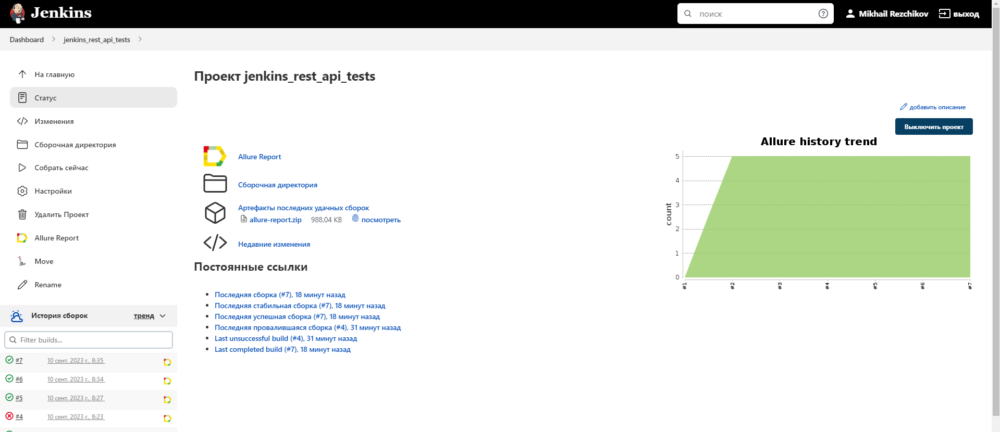
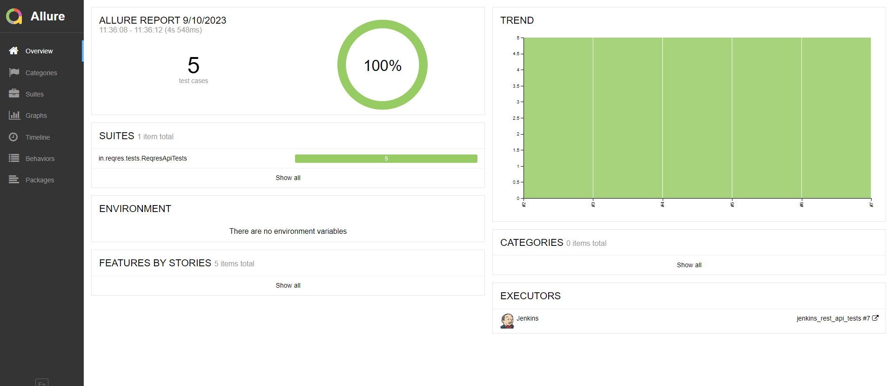
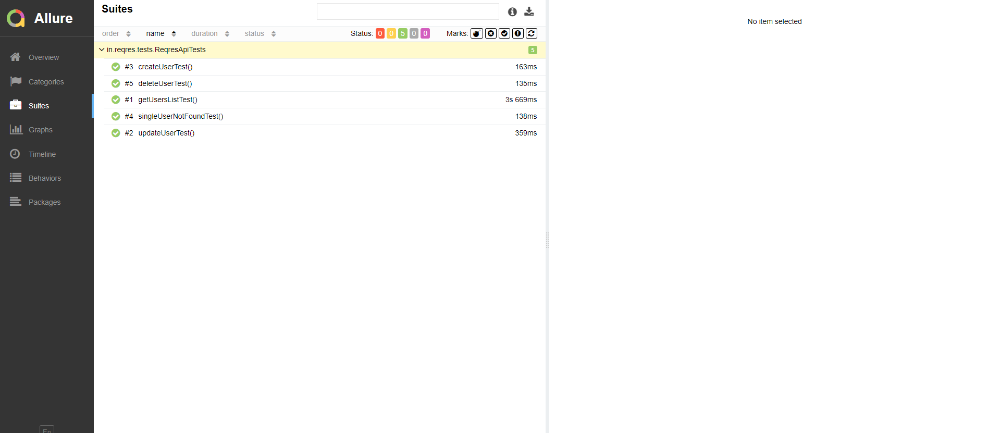
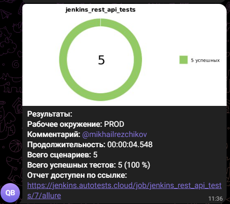

# Проект по автоматизации тестирования API reqres.in

### Технологии и инструменты:
<p align="center">


</p>

### Реализованные проверки:
* Создание нового пользователя
* Проверка наличия пользователя в базе
* Обновление данных пользователя
* Получение данных пользователя по id
* Удаление пользователя 

### Запуск тестов из терминала
#### Локальный запуск тестов:
```bash
gradle clean api_tests
```
    
### Сборка в [Jenkins](https://jenkins.autotests.cloud/job/jenkins_rest_api_tests/)
<p align="center">

</p>

### Отчет в [Allure report](https://jenkins.autotests.cloud/job/jenkins_rest_api_tests/7/allure/)
#### Основная страница отчета
<p align="center">

</p>

#### Тест-кейсы
<p align="center">

</p>

### Уведомления в Telegram с использованием бота
<p align="center">

</p>
